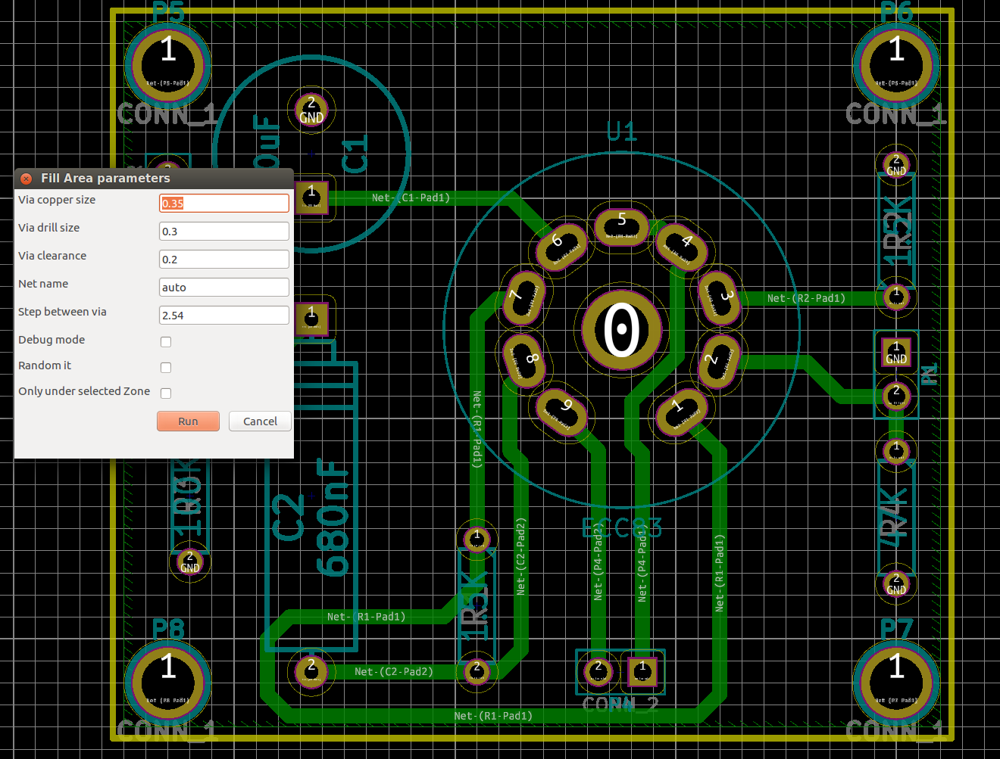
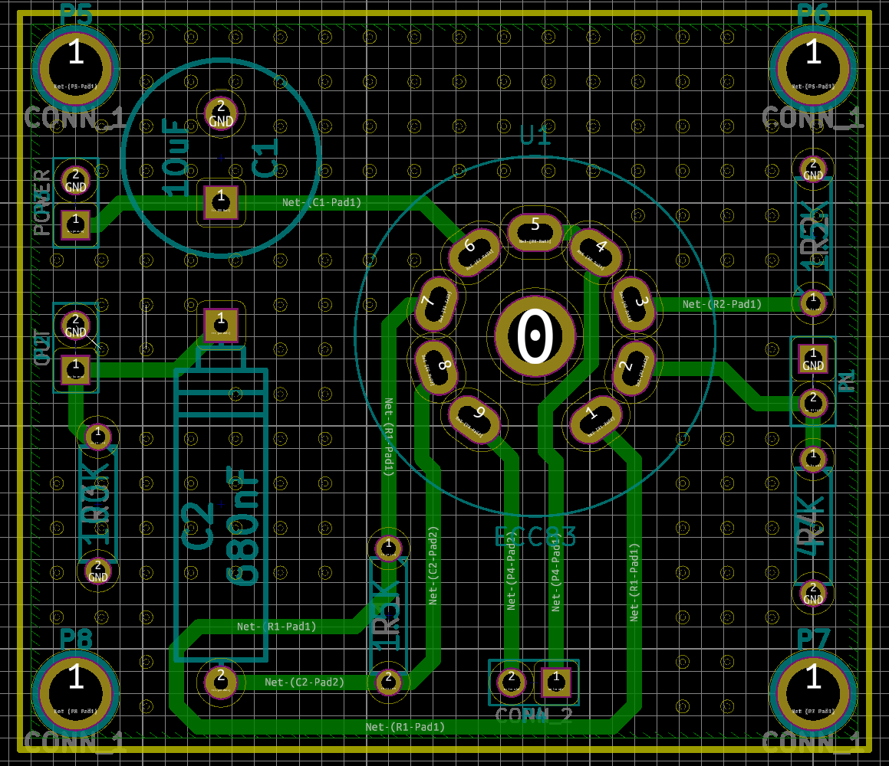
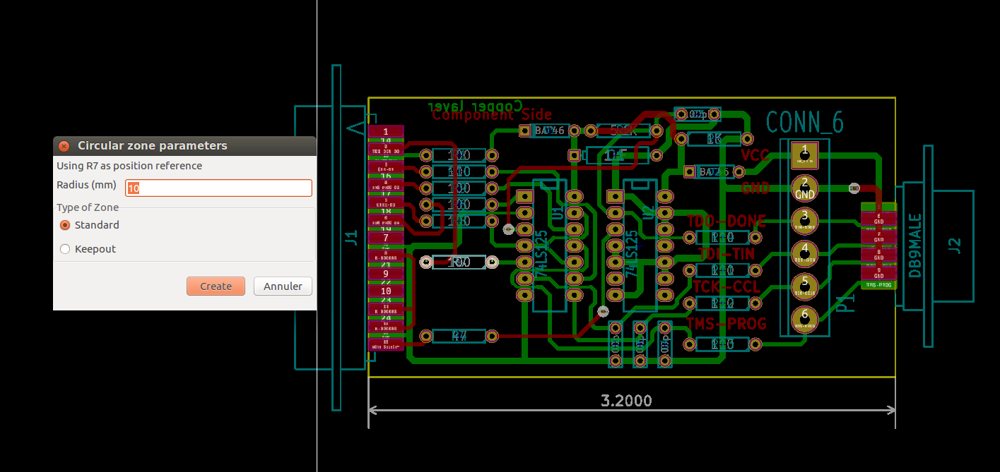
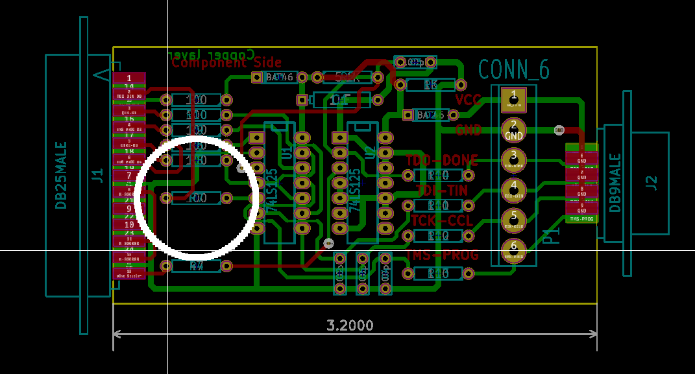
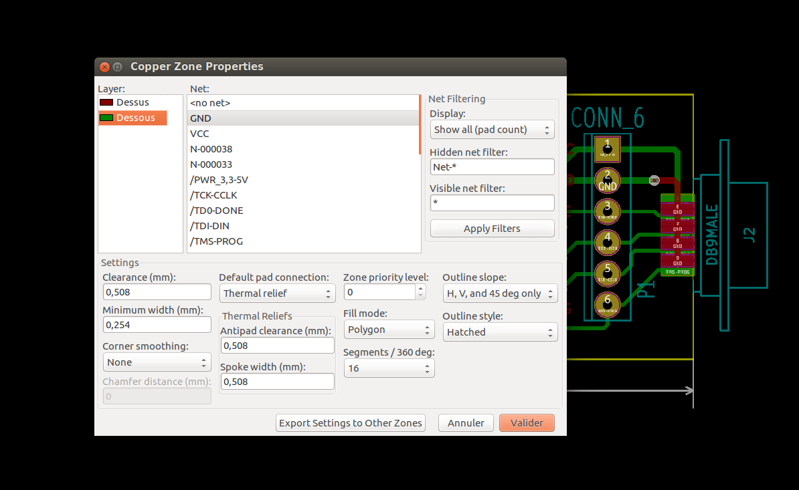
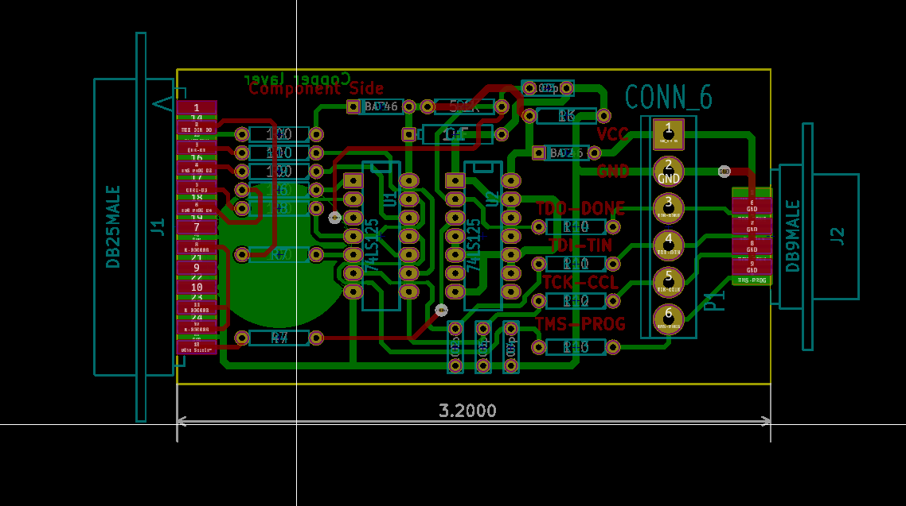

# This branch is the plugin for development version of KiCad

Please select the right branch according your KiCad version:
 - master for development version of KiCad
 - V5.1 for KiCad version 5.1.*

# Know issues

 - Unable to delete VIA (since The old method - used in 5.1 - don't
   work anymore)
 - Via are invisible after plugin run. Need to save and reopen file to
   see them

# Some KiCad plugins in Python

Thoses plugins must be copied inside KiCad's python plugins
directory (~/.kicad_plugins or /usr/share/kicad/scripting/plugins/ for
Linux).
Most of them use python plugin (Action plugins) in KiCad. This feature
is enabled in daily builds of KiCad.
See https://forum.kicad.info/t/howto-register-a-python-plugin-inside-pcbnew-tools-menu/5540

## ViaStitching

A pure python via stitching.

After select "Via Stitching" in Tools menu, choose your options in the
interface.

Then the result should be:

## CircularZone

A pure python script to create circular zone.

Select a component. This composent will be used as center of the
circular zone. If no component is selected, the origin (0,0) will be
used as center.

After select "Create a circular zone" in the Tools menu, choose the
radius and the type of zone (normal or keep out).

A circular zone will be created. Select it to change properties:

Refill the area (B hotkey) then the circular zone is ready.

